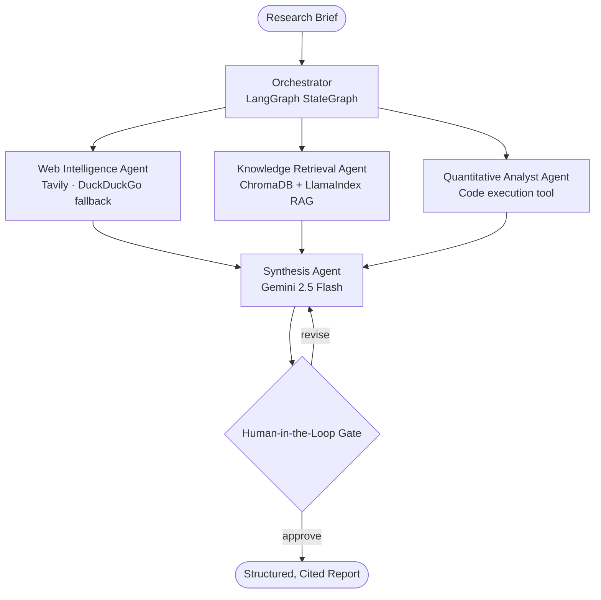

<div align="center">


# Enterprise Research & Analysis Platform (ERA)

## The companion repo for the *Agentic AI Engineering* course — built section by section, lecture by lecture

**A five-agent multi-agent system that turns a research brief into a cited, structured report — searching the web, retrieving from a document knowledge base, running quantitative analysis, and gating the result behind a human review checkpoint.** Built on a stack that costs **$0/month**.

[What is this?](#what-is-this-repository) · [Architecture](#️-architecture) · [Quick Start](#-quick-start) · [Curriculum](#️-curriculum-map) · [About the Instructor](#‍-about-the-instructor)

</div>

---

## Table of Contents

- [What is this repository?](#what-is-this-repository)
- [🚀 Start Here](#-start-here)
- [🏗️ Architecture](#️-architecture)
- [🗺️ Curriculum Map](#️-curriculum-map)
- [🏆 The Five Projects](#-the-five-projects)
- [📁 Repository Structure](#-repository-structure)
- [⚡ Quick Start](#-quick-start)
- [🛤️ Two Ways to Take This Course](#️-two-ways-to-take-this-course)
- [🏗️ From Course Project to Production](#️-from-course-project-to-production)
- [👩🏽‍🏫 About the Instructor](#‍-about-the-instructor)
- [🤝 Contributing](#-contributing)
- [📄 License](#-license)

---

## What is this repository?

This repo is where you build the **ERA Platform** (Enterprise Research & Analysis Platform) — a five-agent AI system that takes a research brief and autonomously searches the web, retrieves from a document knowledge base, runs quantitative analysis, and synthesizes a cited, structured report, gated by a human review checkpoint.

You don't clone a finished system and read about it. You build it, section by section, lecture by lecture, on a stack that costs **$0/month** and requires **no credit card**. By the end of Section 12, the code in this repo _is_ a deployed, observable, portfolio-ready multi-agent system — not a toy example.

What makes this different from most "build an AI agent" courses: nothing is thrown away. The RAG pipeline you build in Section 3 is the same RAG pipeline running inside the Section 12 capstone — wrapped, not replaced. That incremental, production-parity structure is the thing tutorial-style courses skip, and it's the whole point here.

If you're enrolled in the course, this repo is your primary workspace. Fork it, work through the sections in order (or follow the fast-track path — see below), and compare your code against the `solution/` branch for each section whenever you get stuck.

---

## 🚀 Start Here

1. **Fork this repository** to your own GitHub account
2. Follow [Quick Start](#-quick-start) below to get your environment running (~15 minutes)
3. Open `sections/01-welcome-and-the-agentic-ai-landscape/` and follow along with Lecture 1.1
4. Work through each section's exercise before checking its reference solution
5. Stuck? Compare against the matching `solution/section-XX` branch, or open a [Discussion](../../discussions)

**No prior LangGraph, LangChain, or vector database experience is required.** Basic Python (functions, classes, `pip`) is enough to start.

---

## 🏗️ Architecture

The platform is five agents coordinated by a stateful LangGraph orchestrator, communicating exclusively through a typed `ResearchState` — no unstructured string-passing between agents. This is the shape you build toward across the course; see [Repository Structure](#-repository-structure) for what exists in the package today versus what lands section by section.



> No end-to-end sample trace is checked into this repo yet — that's a real gap, not an oversight. Once the Section 12 capstone produces one, it belongs here.

---

## 🗺️ Curriculum Map

The course runs across **four phases, twelve sections, ~143 lectures** (~25 hours full path / ~5.5 hours fast-track). Every section folder in this repo mirrors a course section exactly.

| Phase                     | Sections | What you build                                                                     | Folder                            |
| ------------------------- | -------- | ------------------------------------------------------------------------------------ | ---------------------------------- |
| 🔵 Foundations            | 1–3      | Your dev environment, first LLM calls, a working RAG pipeline                       | `sections/01-*` → `sections/03-*` |
| 🟢 Building Agents        | 4–7      | A tool-using ReAct agent → a LangGraph StateGraph → a 3-agent team → advanced RAG   | `sections/04-*` → `sections/07-*` |
| 🟠 Production             | 8–10     | A streaming FastAPI service, full observability, agent security                     | `sections/08-*` → `sections/10-*` |
| 🔴 Deployment & Capstone | 11–12    | Containerized, CI/CD'd, deployed to the open internet                               | `sections/11-*` → `sections/12-*` |

Full lecture-by-lecture breakdown, research citations, and the fast-track lecture list live in [`docs/curriculum.md`](docs/curriculum.md).

---

## 🏆 The Five Projects

Every project builds directly on the one before it. There is no throwaway code — what you build in Section 3 is still running, unmodified in spirit, inside the capstone in Section 12.

| #   | Project                           | Lands in   | What it adds                                                                                                              | Becomes part of                       |
| --- | --------------------------------- | ---------- | ---------------------------------------------------------------------------------------------------------------------- | -------------------------------------- |
| 1   | **Personal Knowledge Assistant**  | Section 3  | RAG over your own documents — ChromaDB + LlamaIndex + Gemini Embeddings                                                | `era_platform/rag/`                    |
| 2   | **Autonomous Research Assistant** | Section 5  | Project 1 wrapped in a LangGraph `StateGraph` — conditional routing, checkpointing, a human-in-the-loop gate            | `era_platform/agents/orchestrator.py`  |
| 3   | **Three-Agent Team**              | Section 6  | A supervisor agent coordinating a web intelligence agent, a knowledge retrieval agent, and a synthesis agent in parallel | `era_platform/agents/*`                |
| 4   | **REST API**                      | Section 8  | Project 3 exposed via FastAPI — SSE streaming, JWT auth, OpenAPI 3.1                                                    | `era_platform/api/`                    |
| 5   | **Capstone — Full ERA Platform**  | Section 12 | All five agents assembled, containerized, deployed to Railway, traced end-to-end in LangSmith                          | The entire `era_platform/` package     |

This incremental structure is deliberate: it's how production AI systems actually get built, and it's the single biggest thing tutorial-style courses skip.

---

## 📁 Repository Structure

```
agentic-AI-engineering-course/
├── era_platform/              # the shared package — grows section by section
│   ├── agents/                 # orchestrator, web_intelligence, rag_retrieval,
│   │                           # quant_analyst, synthesis
│   ├── rag/                    # ingestion, chunking, retrieval, reranking
│   ├── state/                  # ResearchState Pydantic schema, checkpointing
│   ├── api/                    # FastAPI app, routers, SSE streaming (Sec 8+)
│   ├── evaluation/              # LangSmith evaluators, golden dataset (Sec 9+)
│   └── security/                # prompt injection defense, audit logging (Sec 10+)
│
├── sections/                   # one folder per course section, numbered 01–12
│   ├── 01-welcome-and-the-agentic-ai-landscape/
│   │   └── README.md            # section notes + links to lecture resources
│   ├── 03-rag-fundamentals/
│   │   ├── README.md
│   │   ├── exercise-3E-document-qa/       # starter/ + solution/
│   │   └── project-3P-personal-knowledge-assistant/
│   ├── 05-langgraph-stateful-agents/
│   │   ├── README.md
│   │   ├── exercise.py          # starter code — what you write
│   │   └── solution.py          # reference implementation
│   ├── ...
│   └── 12-capstone/
│       └── README.md            # full architecture walkthrough
│
├── tests/
│   ├── unit/
│   └── integration/
│
├── docs/
│   ├── curriculum.md            # full lecture-by-lecture breakdown
│   ├── adr/                     # Architecture Decision Records
│   └── production.md            # the production-grade upgrade path (AWS, see below)
│
├── docker-compose.yml           # local dev stack (Redis only — everything else is free-tier API)
├── pyproject.toml               # dependencies (PEP 621)
├── .env.example                 # the free-tier keys you need — no secrets committed
└── README.md                    # you are here
```

> **Note:** newer sections (02–04) use a per-exercise `exercise-XE-*/{starter,solution}/` folder pattern; older sections (05, 06, 08) still use a flat `exercise.py`/`solution.py` pair pending retrofit. Both patterns are shown above — check each section's own `README.md` for what applies there.

---

## ⚡ Quick Start

Get the full pipeline running locally in under 15 minutes. No AWS account, no Anthropic subscription, no Pinecone account, no credit card.

### Prerequisites

| Requirement                                          | Notes                                    |
| ----------------------------------------------------- | ----------------------------------------- |
| Python ≥ 3.12                                        | `pyenv` or system install                |
| Docker + Docker Compose ≥ 24.0                       | Only used for local Redis                |
| [Google AI Studio key](https://aistudio.google.com)  | Free — covers Gemini Flash + embeddings  |
| [Groq API key](https://console.groq.com)             | Free — covers routing/classification     |
| [Tavily API key](https://app.tavily.com)             | Free — 1,000 credits/month               |
| [LangSmith API key](https://smith.langchain.com)     | Free — 5,000 traces/month                |

### Setup

```bash
# 1. Clone your fork
git clone https://github.com/<your-username>/agentic-AI-engineering-course.git
cd agentic-AI-engineering-course

# 2. Create and activate a virtual environment
python3.12 -m venv .venv
source .venv/bin/activate        # Windows: .venv\Scripts\activate

# 3. Install dependencies
pip install -e ".[dev]"

# 4. Copy and populate your environment file
cp .env.example .env
# Edit .env — free tier keys only (see table above)

# 5. Start local Redis (the only Docker service you need)
docker compose up -d redis

# 6. Run the Section 1 sanity check
python sections/01-welcome-and-the-agentic-ai-landscape/exercise.py
```

Full per-section setup notes (additional keys needed as you progress, e.g. for Section 8's FastAPI server) live in each section's own `README.md`.

> **Data privacy note:** Google AI Studio's free tier permits using your inputs to improve their models. Use synthetic or publicly available documents for all exercises — never real client or personal data.

---

## 🛤️ Two Ways to Take This Course

- **Full path (~25 hours):** every lecture, every exercise, all 5 projects. For engineers who want deep understanding of _why_, not just _how_.
- **Fast-track (~5.5 hours):** a curated subset of lectures that still includes all 5 projects. See [`docs/curriculum.md`](docs/curriculum.md) for the exact lecture list.

Both paths produce the same final capstone system.

---

## 🏗️ From Course Project to Production

The `era_platform/` package you build in this course is intentionally architected so the **agent logic, state schema, and API surface never change** between the course version and a production deployment — only the backend services swap (Gemini → Claude, ChromaDB → Pinecone, Railway → AWS ECS Fargate, etc.).

That upgrade path — full business case, cost model, and production architecture — is documented in [`docs/production.md`](docs/production.md), based on a real Scope of Work for an enterprise deployment of this same system. It's there so you understand exactly what changes (and what doesn't) when this stops being a course project and starts being a client deliverable.

---

## 👩🏽‍🏫 About the Instructor

**Dr. Jody-Ann S. Jones, PhD** is an AWS Certified Machine Learning Specialist and the creator of **The Data Sensei** (drjodyannjones.com). This course and the ERA Platform are her reference implementation for what a production-grade multi-agent system actually looks like — built to the same standards (typed state, tested, zero-hardcoding, retry-safe) she'd expect from a professional engineering team.

- 🌐 [drjodyannjones.com](https://drjodyannjones.com)
- 🎥 YouTube — [@TheDataSensei](https://youtube.com/@TheDataSensei)

---

## 🤝 Contributing

Found a bug in the course code, or have a fix for an exercise? Contributions are welcome.

```bash
ruff format .
ruff check .
mypy era_platform tests --strict
pytest tests/unit/ tests/integration/
```

1. Fork → branch (`fix/`, `feat/`, `docs/` prefix) → PR against `main`
2. Include tests for any code changes
3. See [`CONTRIBUTING.md`](CONTRIBUTING.md) for the full process

Found an error in a lecture or have a question about the material? Use [Discussions](../../discussions), not Issues — Issues are for bugs in the code.

---

## 📄 License

MIT License. Copyright (c) 2026 Dr. Jody-Ann S. Jones / The Data Sensei. See [`LICENSE`](LICENSE) for full text.

---

<div align="center">

Built with the course, for the course. Fork it and start with [Section 1](sections/01-welcome-and-the-agentic-ai-landscape/).

</div>
