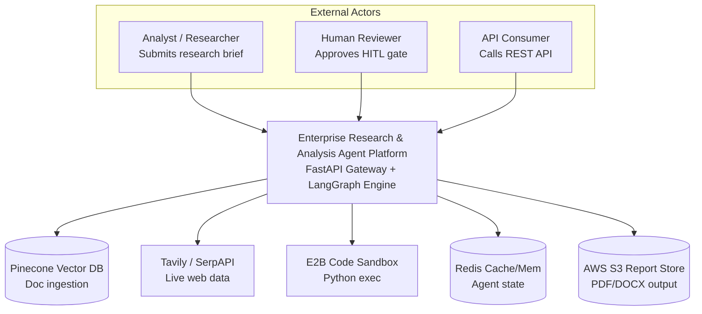
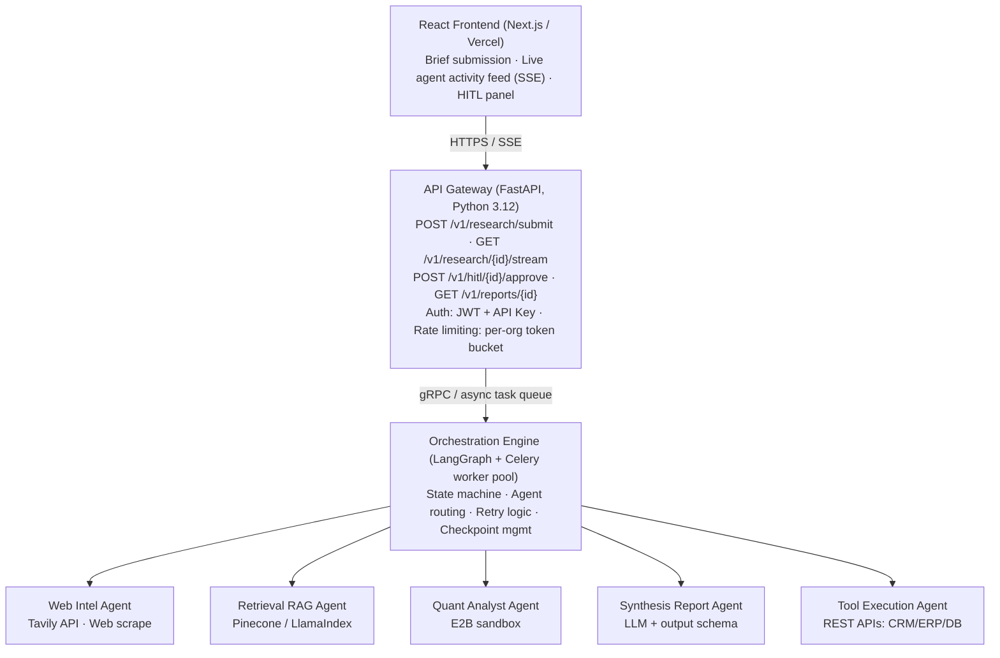
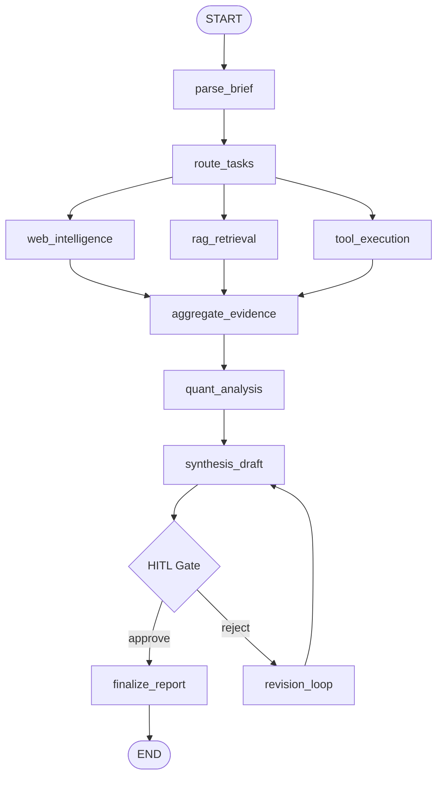
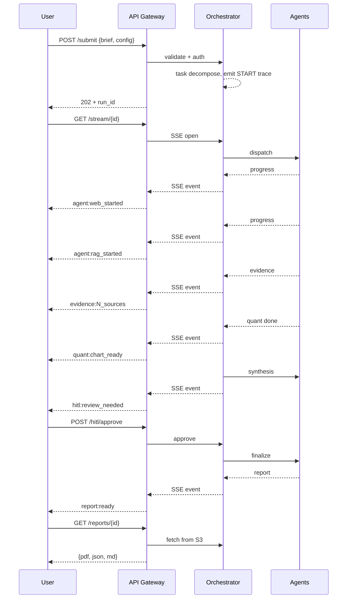
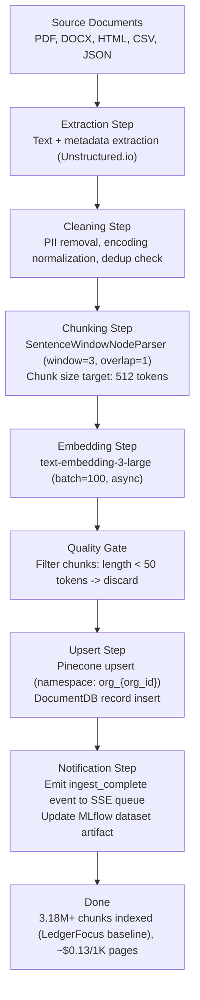
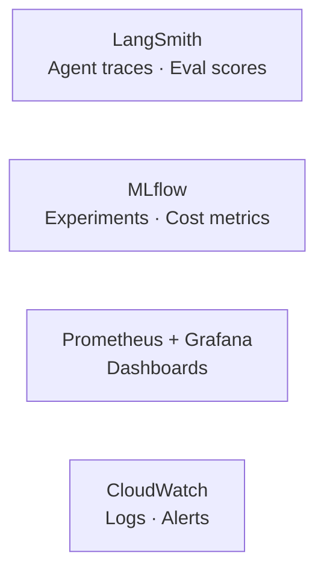

# Enterprise Research & Analysis Agent Platform

## Scope of Work — System Design, Architecture & Technical Specification

**Prepared by:** Dr. Jody-Ann S. Jones — Principal ML Engineer, The Data Sensei · AWS Certified ML Specialist

**Version 1.0 · June 2026 · CONFIDENTIAL**

---

## Table of Contents

- [1. Executive Summary](#1-executive-summary)
  - [1.1 Problem Statement](#11-problem-statement)
  - [1.2 Solution Overview](#12-solution-overview)
  - [1.3 Key Metrics & Success Criteria](#13-key-metrics--success-criteria)
- [2. System Design & Architecture](#2-system-design--architecture)
  - [2.1 Architectural Philosophy](#21-architectural-philosophy)
  - [2.2 High-Level System Context Diagram (C4 Level 1)](#22-high-level-system-context-diagram-c4-level-1)
  - [2.3 Container Architecture Diagram (C4 Level 2)](#23-container-architecture-diagram-c4-level-2)
  - [2.4 Agent Component Diagram (C4 Level 3)](#24-agent-component-diagram-c4-level-3)
  - [2.5 Data Flow Diagram](#25-data-flow-diagram)
- [3. Agent Specifications](#3-agent-specifications)
  - [3.1 Orchestrator Agent](#31-orchestrator-agent)
  - [3.2 Web Intelligence Agent](#32-web-intelligence-agent)
  - [3.3 Knowledge Retrieval Agent (Agentic RAG)](#33-knowledge-retrieval-agent-agentic-rag)
  - [3.4 Quantitative Analyst Agent](#34-quantitative-analyst-agent)
  - [3.5 Synthesis & Report Agent](#35-synthesis--report-agent)
  - [3.6 Tool Execution Agent](#36-tool-execution-agent)
- [4. Data Architecture](#4-data-architecture)
  - [4.1 State Schema](#41-state-schema)
  - [4.2 Storage Architecture](#42-storage-architecture)
  - [4.3 Ingestion Pipeline](#43-ingestion-pipeline)
- [5. Tradeoff Analysis](#5-tradeoff-analysis)
  - [5.1 Orchestration Framework: LangGraph vs. CrewAI vs. AutoGen](#51-orchestration-framework-langgraph-vs-crewai-vs-autogen)
  - [5.2 Vector Database: Pinecone vs. Weaviate vs. pgvector](#52-vector-database-pinecone-vs-weaviate-vs-pgvector)
  - [5.3 LLM Provider Strategy: Single vs. Multi-Provider](#53-llm-provider-strategy-single-vs-multi-provider)
  - [5.4 Code Execution Sandbox: E2B vs. Self-Hosted Docker](#54-code-execution-sandbox-e2b-vs-self-hosted-docker)
  - [5.5 API Design: REST+SSE vs. WebSocket vs. gRPC](#55-api-design-restsse-vs-websocket-vs-grpc)
  - [5.6 Deployment: ECS Fargate vs. Kubernetes (EKS)](#56-deployment-ecs-fargate-vs-kubernetes-eks)
- [6. Security, Compliance & Data Governance](#6-security-compliance--data-governance)
  - [6.1 Security Architecture](#61-security-architecture)
  - [6.2 Multi-Tenancy & Data Isolation](#62-multi-tenancy--data-isolation)
  - [6.3 Compliance Considerations](#63-compliance-considerations)
- [7. Observability & Evaluation Framework](#7-observability--evaluation-framework)
  - [7.1 Observability Stack](#71-observability-stack)
  - [7.2 Key Performance Indicators (KPIs)](#72-key-performance-indicators-kpis)
  - [7.3 LLM Evaluation Framework](#73-llm-evaluation-framework)
- [8. Phased Build Plan](#8-phased-build-plan)
  - [Phase 1 — Core Scaffold (Weeks 1–2)](#phase-1--core-scaffold-weeks-12)
  - [Phase 2 — Agent Expansion (Weeks 3–4)](#phase-2--agent-expansion-weeks-34)
  - [Phase 3 — Production Hardening (Weeks 5–6)](#phase-3--production-hardening-weeks-56)
  - [Phase 4 — Course & Portfolio Packaging (Weeks 7–8)](#phase-4--course--portfolio-packaging-weeks-78)
- [9. API Reference](#9-api-reference)
  - [9.1 SSE Event Schema](#91-sse-event-schema)
- [10. Cost Model](#10-cost-model)
  - [10.1 Per-Report Cost Breakdown](#101-per-report-cost-breakdown)
  - [10.2 Infrastructure Monthly Base Cost (v1 Production)](#102-infrastructure-monthly-base-cost-v1-production)
- [11. Risk Register](#11-risk-register)
- [12. Glossary](#12-glossary)

---

# 1. Executive Summary

This document defines the complete technical Scope of Work for the Enterprise Research & Analysis Agent Platform — a production-grade, multi-agent AI system designed to autonomously research, synthesize, and deliver structured intelligence reports for financial services, consulting, private equity, and knowledge-intensive enterprise domains.

| Mission Statement |
| :---- |
| Build a horizontally scalable, multi-agent orchestration system that transforms unstructured research briefs into auditable, citation-backed intelligence reports — replacing 40–60 hours of manual analyst work per engagement with a fully automated, human-in-the-loop pipeline that completes in under 90 minutes. |

## 1.1 Problem Statement

Knowledge workers in financial services, consulting, and private equity spend a disproportionate share of billable time on rote research tasks: scouring web sources, extracting data from documents, cross-referencing contradictory claims, and writing structured synthesis documents. Existing solutions either require heavy manual effort (traditional research workflows) or sacrifice quality and provenance (single-LLM summarization). Neither is acceptable at enterprise scale.

The gap in the market is a system that maintains the rigor of human-led research while operating at machine speed — with full auditability, source provenance, and a human review checkpoint before any output is delivered.

## 1.2 Solution Overview

The platform deploys five specialized AI agents coordinated by a stateful LangGraph orchestrator. Each agent owns a discrete capability domain. Agents communicate through a shared state graph, pass structured typed messages, and write to a shared evidence store. A human-in-the-loop (HITL) checkpoint gates final synthesis before delivery.

## 1.3 Key Metrics & Success Criteria

| Metric | Baseline (Manual) | Target (Automated) | Measurement Method |
| :---- | :---- | :---- | :---- |
| Research cycle time | 40–60 hours | < 90 minutes | P95 wall-clock time per brief |
| Source coverage | 15–25 sources | 50–150 sources | Sources cited per report |
| Report accuracy (factual) | ~90% (human error) | > 98% (with HITL gate) | Expert spot-check sample |
| Hallucination rate | N/A | < 0.5% | LangSmith eval + human review |
| System uptime | N/A | > 99.5% | AWS CloudWatch SLO monitoring |
| Cost per report | $500–2000 (analyst time) | < $8 (API + infra) | Per-run cost attribution via MLflow |
| HITL throughput | N/A | < 15 min review time | Reviewer session analytics |

# 2. System Design & Architecture

## 2.1 Architectural Philosophy

The system follows four governing principles established for production agentic systems at scale:

* Deterministic orchestration over emergent coordination — the LangGraph state machine enforces explicit transitions; agents do not autonomously re-route themselves.

* Typed state contracts — all inter-agent communication passes through a versioned Pydantic schema; no unstructured string passing between agents.

* Tool isolation — each agent operates in a sandboxed tool namespace with least-privilege access; a web agent cannot write to the evidence store directly.

* Observability first — every agent invocation emits a trace to LangSmith and a metric to MLflow before any business logic executes.

## 2.2 High-Level System Context Diagram (C4 Level 1)

This diagram situates the platform within its external dependencies and end-user touchpoints.



## 2.3 Container Architecture Diagram (C4 Level 2)

This diagram decomposes the platform into its primary deployable containers and their communication protocols.



## 2.4 Agent Component Diagram (C4 Level 3)

This diagram details the internal structure of each agent and the orchestrator's routing logic.

**`ResearchState` (Pydantic) — fields owned by the orchestrator:**

```python
brief_parsed, task_plan            # from parse_brief
web_results, source_graph          # from web_intelligence
rag_evidence, doc_refs             # from rag_retrieval
quant_analysis                     # from quant_analysis
hitl_status, final_report          # from the HITL gate / finalize_report
trace_ids                          # observability, written by every node
```

**State transitions:**



## 2.5 Data Flow Diagram

This diagram traces the lifecycle of a research brief from submission to final report delivery.



# 3. Agent Specifications

Each agent is an independently deployable Python class implementing the BaseAgent interface. All agents are registered in the AgentRegistry and are instantiated by the orchestrator on-demand. The following specifications define each agent's responsibilities, inputs, outputs, tool access, and failure modes.

## 3.1 Orchestrator Agent

The orchestrator is a LangGraph supervisor node — it does not call any external LLM API directly. It routes, schedules, and manages state transitions.

| Property | Specification |
| :---- | :---- |
| Implementation | LangGraph StateGraph with typed ResearchState Pydantic model |
| Routing strategy | LLM-based conditional routing at parse_brief → route_tasks node |
| Parallelism model | asyncio.gather for web / rag / tool agents; serial for quant → synthesis |
| Max parallel agents | 4 concurrent (configurable via ORCHESTRATOR_MAX_WORKERS env var) |
| State persistence | Redis (TTL 24h) + S3 checkpoint every major transition |
| Retry policy | Exponential backoff: 3 attempts, 2s/8s/32s delays, per agent |
| HITL gate logic | Pauses graph; emits SSE event; waits up to 2h for approval webhook |
| Observability | LangSmith trace per run; MLflow run per report; Prometheus counter per transition |

## 3.2 Web Intelligence Agent

| Property | Specification |
| :---- | :---- |
| Primary tool | Tavily Search API (tier: advanced, include_raw_content: true) |
| Fallback tool | SerpAPI + custom async scraper (httpx + BeautifulSoup4) |
| Source limit | 150 URLs per run; top 50 by relevance score returned to state |
| Credibility scoring | Domain authority heuristic (news > gov > edu > commercial) + publication date recency |
| Deduplication | URL canonicalization + MinHash LSH (Jaccard threshold 0.85) |
| Outputs emitted | List[WebSource(url, title, excerpt, credibility_score, timestamp)] |
| Error handling | 429 rate-limit → exponential backoff; 403 → skip and log; timeout 10s/request |
| PII handling | Strips email/phone patterns before writing to state; never logs raw scraped content |

## 3.3 Knowledge Retrieval Agent (Agentic RAG)

| Property | Specification |
| :---- | :---- |
| Vector store | Pinecone (pod type: p2.x1, metric: cosine, dimensions: 3072) |
| Embedding model | text-embedding-3-large (OpenAI, 3072-dim) |
| Retrieval strategy | Hybrid: dense (top-k=40) + sparse BM25 (top-k=40) → reciprocal rank fusion |
| Reranking | Cohere Rerank v3 (top_n=20 from 80 candidates) |
| Query expansion | HyDE (Hypothetical Document Embeddings) for domain-specific queries |
| Context window mgmt | LlamaIndex SentenceWindowNodeParser; context budget: 16K tokens per agent turn |
| Evidence graph | NetworkX DiGraph: nodes=chunks, edges=semantic similarity > 0.82 |
| Contradiction detection | Dual-pass: same-claim extraction → entailment check via NLI model (DeBERTa-v3) |
| Source provenance | Every chunk tagged with doc_id, page, section, ingest_timestamp |

## 3.4 Quantitative Analyst Agent

| Property | Specification |
| :---- | :---- |
| Execution environment | E2B cloud sandbox (Python 3.12, isolated per-run, 5-min max timeout) |
| Available libraries | pandas, numpy, scipy, statsmodels, matplotlib, seaborn, plotly |
| Code generation | LLM generates Python scripts; static AST analysis rejects unsafe patterns |
| Safety controls | Blocklist: os.system, subprocess, __import__, open() in write mode, socket |
| Output artifacts | PNG charts (300 DPI) + JSON data tables + LaTeX equation strings |
| Statistical methods | Descriptive stats, correlation analysis, time-series decomposition, regression |
| Chart types supported | Line, bar, scatter, heatmap, box, histogram, candlestick (financial) |
| Artifact storage | S3 bucket: s3://era-artifacts/{run_id}/quant/ with pre-signed URLs |

## 3.5 Synthesis & Report Agent

| Property | Specification |
| :---- | :---- |
| LLM | Claude claude-opus-4-6 (primary); GPT-4.1 (fallback on rate-limit) |
| Output schema | ReportSchema (Pydantic): title, executive_summary, sections[], citations[], confidence |
| Citation format | Vancouver numeric [1] with full metadata; auto-linked to source_graph |
| Confidence scoring | Per-claim confidence: high/medium/low based on source count + credibility aggregate |
| Output formats | Markdown (primary), PDF (via WeasyPrint), DOCX (via python-docx) |
| Structured sections | Executive Summary · Key Findings · Quantitative Analysis · Risk Factors · Citations |
| Hallucination mitigation | Constrained generation: every factual claim must map to ≥1 source in evidence store |
| Token budget | Max 12K output tokens; auto-truncate with summary if over budget |

## 3.6 Tool Execution Agent

| Property | Specification |
| :---- | :---- |
| Purpose | Executes structured actions against external enterprise systems via REST/GraphQL |
| Auth model | Per-integration OAuth2 tokens stored in AWS Secrets Manager; never in state |
| Supported integrations | Salesforce, HubSpot, Linear, Jira, Notion, Airtable, generic REST webhook |
| Action contract | ToolAction(integration, method, params) → ToolResult(success, data, error) |
| Dry-run mode | All actions execute in dry-run mode by default; explicit user approval to commit |
| Rate limiting | Per-integration token bucket (configurable); auto-queues on limit hit |
| Audit log | Every action logged to append-only DynamoDB table with requester, timestamp, payload hash |

# 4. Data Architecture

## 4.1 State Schema

All inter-agent communication is mediated through a versioned Pydantic ResearchState object. This is the single source of truth for a run. No agent reads from or writes to any external store directly — all mutations flow through the orchestrator's state update mechanism.

```python
class ResearchState(BaseModel):
    # Identity
    run_id: str                            # UUID4, immutable after creation
    org_id: str                            # Tenant identifier
    schema_version: str = "1.0"

    # Brief
    brief: ResearchBrief                   # Submitted query + config
    task_plan: List[AgentTask]             # Decomposed subtasks

    # Agent outputs (write-once per agent)
    web_results: List[WebSource] = []
    rag_evidence: List[RAGChunk] = []
    tool_results: List[ToolResult] = []
    quant_outputs: List[QuantArtifact] = []
    draft_report: Optional[ReportDraft] = None

    # Control flow
    current_node: str = "start"
    completed_nodes: List[str] = []
    hitl_status: HITLStatus = HITLStatus.PENDING
    hitl_feedback: Optional[str] = None
    revision_count: int = 0

    # Observability
    trace_ids: Dict[str, str] = {}         # agent_name -> langsmith trace_id
    mlflow_run_id: Optional[str] = None
    created_at: datetime
    updated_at: datetime
```

## 4.2 Storage Architecture

| Store | Technology | Data | TTL / Retention | Access Pattern |
| :---- | :---- | :---- | :---- | :---- |
| Hot state | Redis Cluster (ElastiCache) | ResearchState JSON, SSE queues | 24 hours | Read-heavy, O(1) key-value |
| Vector store | Pinecone (dedicated pod) | Embeddings + metadata (3.18M+ chunks) | Permanent until explicit delete | Approximate NN search, hybrid |
| Document store | AWS DocumentDB | Raw ingested docs, chunk records | 90 days raw; permanent indexed | Query by doc_id, org_id, date |
| Artifact store | AWS S3 (versioned) | Charts, PDFs, DOCX reports | 7 days presigned URLs; permanent archive | Key-value, presigned URL access |
| Audit log | AWS DynamoDB (append-only) | Tool actions, HITL events, API calls | 7 years (compliance) | Write-once; GSI query by org/date |
| Metrics store | MLflow (RDS backend) | Experiment runs, cost metrics, evals | Permanent | Query by run_id, model, date |
| Traces | LangSmith Cloud | Agent traces, LLM I/O, latencies | 90 days | Dashboard + API |
| Config store | AWS Parameter Store (SSM) | Feature flags, model configs, rate limits | Permanent | Read at startup + hot-reload |

## 4.3 Ingestion Pipeline

Documents enter the system through a ZenML pipeline that handles ingestion, chunking, embedding, and indexing. This pipeline is idempotent and can be re-triggered for re-indexing.



# 5. Tradeoff Analysis

Every architectural decision at scale involves explicit tradeoffs. The following analysis documents the decision space for each major technical choice, the option considered, the rationale, and the accepted costs.

## 5.1 Orchestration Framework: LangGraph vs. CrewAI vs. AutoGen

| Dimension | LangGraph ✓ CHOSEN | CrewAI | AutoGen |
| :---- | :---- | :---- | :---- |
| State management | Typed Pydantic state graph; explicit | Implicit role-based passing | Conversation history only |
| Control flow | Deterministic graph traversal | Role-based delegation (non-deterministic) | Agent negotiation (non-deterministic) |
| Production readiness | Mature; LangSmith native integration | Newer; limited observability tooling | Research-grade; Microsoft-maintained |
| Human-in-the-loop | Native checkpoint/interrupt support | Manual implementation required | Human proxy agent (hacky) |
| Parallel execution | Native async branches | Sequential by default | Can parallelize but complex |
| Enterprise adoption | High (used by LangChain ecosystem) | Growing but limited case studies | Limited production case studies |
| Accepted cost | Higher initial implementation overhead | — | — |

## 5.2 Vector Database: Pinecone vs. Weaviate vs. pgvector

| Dimension | Pinecone ✓ CHOSEN | Weaviate | pgvector (Postgres) |
| :---- | :---- | :---- | :---- |
| Managed infra | Fully managed; zero ops | Self-hosted or managed cloud | Self-managed Postgres instance |
| Scale (3M+ vectors) | Handles easily (dedicated pod p2.x1) | Handles; requires tuning | Degrades at > 1M without sharding |
| Hybrid search | Native sparse+dense | Native BM25 + vector | Extension required; less mature |
| Multi-tenancy | Namespace-based isolation (per-org) | Multi-tenancy via class schema | Schema-per-tenant pattern |
| Latency (P99) | ~80ms (dedicated pod) | ~120ms (cloud) | ~200ms (unoptimized) |
| Cost at scale | Higher ($0.096/hr dedicated pod) | Lower (self-hosted) | Lowest (existing Postgres) |
| Accepted cost | Highest unit cost; vendor lock-in risk | — | — |

## 5.3 LLM Provider Strategy: Single vs. Multi-Provider

| Consideration | Decision | Rationale |
| :---- | :---- | :---- |
| Primary synthesis LLM | Claude claude-opus-4-6 (Anthropic) | Strongest long-context reasoning; best citation discipline; lower hallucination rate in financial domain benchmarks |
| Primary embedding model | text-embedding-3-large (OpenAI) | 3072-dim; highest retrieval accuracy in MTEB benchmarks for financial text |
| Fallback strategy | GPT-4.1 on rate-limit / outage | Maintains API compatibility; same JSON output schema enforced via instructor library |
| Cost optimization | claude-haiku-4-5 for classification tasks | 10x cheaper; sufficient for intent parsing, claim classification, routing decisions |
| Open-source option | Mistral / Llama 3 considered but deferred | Latency and quality gap for synthesis tasks; revisit at v2 if on-prem requirement emerges |
| Context window | 200K (Opus 4) as working limit | Large evidence bundles fit without chunking the synthesis prompt; critical for 150-source reports |

## 5.4 Code Execution Sandbox: E2B vs. Self-Hosted Docker

| Dimension | E2B ✓ CHOSEN | Self-Hosted Docker Exec |
| :---- | :---- | :---- |
| Isolation model | Micro-VM per execution (Firecracker) | Docker container (weaker isolation boundary) |
| Cold start | ~300ms | ~800ms (image pull on cold) |
| Security posture | Hypervisor-level isolation; no shared kernel | Container escape is a known attack vector |
| Library support | Pre-installed scientific Python stack | Custom image required per environment |
| Cost per execution | $0.00025/second (generous free tier) | EC2 instance cost + management overhead |
| Ops burden | Zero (fully managed) | High (image versioning, vulnerability patching) |
| Accepted cost | Vendor dependency; egress latency | — |

## 5.5 API Design: REST+SSE vs. WebSocket vs. gRPC

| Consideration | Decision | Rationale |
| :---- | :---- | :---- |
| Client-facing API | REST + Server-Sent Events (SSE) | SSE is unidirectional push — ideal for progress streaming; simpler than WebSocket for this use case; works through load balancers and CDNs without special config |
| Internal agent comms | Async Python (asyncio) via shared Redis state | Agents are co-located in worker pool; Redis pub/sub handles inter-process events without network overhead |
| B2B API consumers | REST (OpenAPI 3.1 spec; auto-generated SDK) | Easiest integration path; gRPC deferred to v2 if latency becomes a bottleneck at 10K+ req/day |
| Webhook callbacks | POST webhook on run completion | Decouples long-running jobs from client connection lifecycle; clients don't need to hold SSE open for 90 minutes |

## 5.6 Deployment: ECS Fargate vs. Kubernetes (EKS)

| Dimension | ECS Fargate ✓ CHOSEN (v1) | EKS (planned for v2) |
| :---- | :---- | :---- |
| Ops complexity | Low — no node management; AWS-managed control plane | High — requires cluster ops expertise |
| Autoscaling | Service-level autoscaling via Application Auto Scaling | HPA + KEDA (event-driven); more granular but complex |
| Cold start | ~30s (Fargate task start) | ~15s (pre-warmed node pool) |
| Cost efficiency | Higher per-vCPU vs EC2; no idle waste | Lower per-vCPU on EC2 nodes; idle waste if not right-sized |
| GPU workloads | Not supported on Fargate | P3/G4 instance node groups available |
| Migration path | ECS task definitions → EKS manifests is well-documented | — |
| Decision rationale | Correct for v1 throughput (<100 concurrent runs); EKS warranted at 500+ concurrent | — |

# 6. Security, Compliance & Data Governance

## 6.1 Security Architecture

The platform enforces a defense-in-depth model. Security controls are applied at every layer — network, API, application, data, and agent execution.

| Layer | Control | Implementation |
| :---- | :---- | :---- |
| Network | VPC isolation | All services in private subnets; only ALB in public subnet |
| Network | TLS everywhere | TLS 1.3 minimum; mutual TLS between internal services |
| API | Authentication | JWT (RS256) for user sessions; API Key (SHA-256 hashed) for B2B |
| API | Authorization | RBAC: roles [viewer, analyst, reviewer, admin]; per-org namespace isolation |
| API | Rate limiting | Token bucket: 60 req/min per API key; burst to 120 for 10s |
| Application | Input validation | Pydantic strict mode on all API inputs; max brief size: 50KB |
| Application | Prompt injection defense | Brief content sanitized before inclusion in LLM prompts; system/user role separation enforced |
| Agent | Tool permission scoping | Each agent has explicit allow-list of tool names; orchestrator enforces at dispatch |
| Agent | Code execution safety | AST static analysis before E2B execution; blocklist pattern matching |
| Data | Encryption at rest | S3 SSE-KMS; DynamoDB encryption; Pinecone encryption enabled |
| Data | Encryption in transit | All external calls over HTTPS/TLS; internal Redis TLS enabled |
| Data | PII handling | PII stripped from web scrape outputs before writing to state; no PII in traces |
| Audit | Immutable audit log | DynamoDB append-only table: all API calls, tool executions, HITL events |
| Secrets | Credential management | AWS Secrets Manager; zero secrets in environment variables or code |

## 6.2 Multi-Tenancy & Data Isolation

The platform supports multiple organizations from a single deployment. Isolation is enforced at the data layer, not the application layer.

* Pinecone: each organization writes to its own namespace (org_{org_id}); queries are namespaced at the API call level

* DocumentDB: org_id field on every document; all queries include org_id filter enforced by the data access layer

* S3: bucket key prefix: {org_id}/{run_id}/; bucket policy denies cross-org access

* Redis: key prefix: {org_id}:{run_id}:*; key expiry enforced uniformly

* DynamoDB: org_id as partition key; no cross-partition queries permitted in application code

## 6.3 Compliance Considerations

| Regulation / Standard | Applicability | Controls in Place |
| :---- | :---- | :---- |
| SOC 2 Type II | Likely required for enterprise clients | Audit logging, access controls, encryption, incident response runbook |
| GDPR / CCPA | If processing EU/CA personal data | PII stripping pipeline, right-to-deletion via org data purge API, data residency config |
| FINRA / SEC 17a-4 | If used by registered broker-dealers | Immutable audit log (WORM via S3 Object Lock), 7-year retention in DynamoDB |
| HIPAA | If healthcare domain adopted | PHI must not enter the web intelligence agent; BAA with AWS required; additional encryption |
| AI Act (EU) | If deployed to EU customers | Human-in-the-loop gate satisfies high-risk AI oversight requirement; model transparency docs required |

# 7. Observability & Evaluation Framework

## 7.1 Observability Stack

**Instrumentation layer** — every agent invocation, in order:

1. Open LangSmith trace → log prompt, model, token count
2. MLflow run start → log params, tags
3. Prometheus counter → increment `agent_invocations_total`
4. Structured log (JSON) → emit to CloudWatch Logs

**Aggregation layer:**



**Alerting rules:**

| Condition | Channel |
| :---- | :---- |
| P95 latency > 120 min | PagerDuty |
| Hallucination rate > 1% | Slack #ml-alerts |
| Agent error rate > 5% | PagerDuty |
| Cost per report > $15 | Slack #cost-alerts |

## 7.2 Key Performance Indicators (KPIs)

| KPI | Definition | Target | Alert Threshold |
| :---- | :---- | :---- | :---- |
| Report generation P95 | Wall clock: brief → finalized report | < 90 min | > 120 min |
| Agent success rate | % runs completing without orchestrator retry | > 98% | < 95% |
| RAG retrieval precision@20 | % of top-20 chunks relevant to query | > 80% | < 70% |
| Hallucination rate | % factual claims without source support (eval sample) | < 0.5% | > 1% |
| HITL review time (P90) | Time from review_needed to approve/reject | < 15 min | > 30 min |
| Cost per report | Sum of LLM API + infra + tool costs per run_id | < $8 | > $15 |
| API error rate | 4xx + 5xx / total requests (5-min window) | < 0.1% | > 1% |
| Embedding freshness | % queries hitting stale chunks (> 90 days old) | < 10% | > 25% |

## 7.3 LLM Evaluation Framework

The platform implements continuous automated evaluation using LangSmith Evals + custom evaluators. Evaluation runs are triggered on every production report and on every model or prompt change.

| Evaluator | Metric | Method | Frequency |
| :---- | :---- | :---- | :---- |
| Faithfulness | Is every claim grounded in a source? | LLM-as-judge (Claude claude-haiku-4-5) + source lookup | Per report |
| Answer Relevance | Does the report address the research brief? | Cosine similarity: brief embedding vs. report embedding | Per report |
| Citation Accuracy | Do citations correctly reference their source? | Source text lookup + NLI entailment check | Per report |
| Completeness | Are all brief sub-questions addressed? | LLM-as-judge with brief decomposition | Per report |
| Regression | Does output quality hold after model/prompt changes? | Golden dataset (50 reports) re-run | Per deploy |

# 8. Phased Build Plan

The platform is built in four phases over eight weeks. Each phase delivers a working, deployable increment. The capstone course curriculum maps directly to this build sequence.

## Phase 1 — Core Scaffold (Weeks 1–2)

**Deliverable:** Running LangGraph orchestrator with retrieval agent and streaming API

- LangGraph StateGraph with ResearchState Pydantic model and 3 nodes: parse_brief, rag_retrieval, synthesis_draft
- Pinecone namespace setup + LlamaIndex ingestion pipeline for a sample document corpus
- FastAPI app: POST /v1/research/submit + GET /v1/research/{id}/stream (SSE)
- Basic Next.js frontend: brief submission form + live event log panel
- Docker Compose stack: api, worker, redis, postgres (MLflow backend)
- LangSmith project wired; first traces visible in dashboard

## Phase 2 — Agent Expansion (Weeks 3–4)

**Deliverable:** Full 5-agent system with parallel execution and evidence aggregation

- Web Intelligence Agent: Tavily integration + MinHash deduplication + credibility scoring
- Quantitative Analyst Agent: E2B sandbox + chart generation + S3 artifact storage
- Tool Execution Agent: Webhook pattern + dry-run mode + audit log (DynamoDB)
- Parallel agent dispatch via asyncio.gather in orchestrator
- Redis pub/sub for cross-agent SSE event propagation
- Evidence graph (NetworkX) + contradiction detection (DeBERTa NLI)
- MLflow experiment tracking: per-run cost attribution + artifact logging

## Phase 3 — Production Hardening (Weeks 5–6)

**Deliverable:** Production-ready system with security, HITL, and observability

- HITL gate: pause/resume in LangGraph + HITL review UI panel in frontend
- JWT + API key auth; RBAC middleware; per-org namespace isolation
- Retry logic: exponential backoff per agent; orchestrator-level dead letter handling
- Prometheus metrics + Grafana dashboard: all 8 KPIs instrumented
- LangSmith eval suite: faithfulness + citation accuracy evaluators wired
- ECS Fargate task definitions + Application Load Balancer + Auto Scaling config
- Terraform IaC: VPC, subnets, security groups, ECS cluster, ElastiCache, S3 buckets
- CI/CD: GitHub Actions pipeline with pytest + integration tests + Docker build + ECS deploy

## Phase 4 — Course & Portfolio Packaging (Weeks 7–8)

**Deliverable:** Public demo + course curriculum + GitHub repository + portfolio artifact

- Live demo environment: deployed to AWS with a curated financial research use case
- Demo data: 500 pre-indexed financial documents (earnings reports, regulatory filings, research papers)
- GitHub repository: production-grade README, architecture diagrams, setup guide, cost estimator
- Course curriculum (drjodyannjones.com): 8 modules mapped 1:1 to build phases
- Architecture Decision Records (ADRs) for each major tradeoff (Section 5 of this SOW)
- This SOW published as the capstone specification document
- Upwork profile update: new portfolio entry with demo link, tech stack, and impact metrics

# 9. API Reference

The platform exposes a RESTful API following OpenAPI 3.1. All endpoints require authentication. Base URL: https://api.era-platform.com/v1

| Method | Endpoint | Description | Auth | Response |
| :---- | :---- | :---- | :---- | :---- |
| POST | /research/submit | Submit a research brief; returns run_id | JWT / API Key | 202 + {run_id, estimated_completion} |
| GET | /research/{id}/stream | SSE stream of agent progress events | JWT / API Key | text/event-stream |
| GET | /research/{id}/status | Polling fallback for run status | JWT / API Key | 200 + RunStatus |
| POST | /hitl/{id}/approve | Approve HITL gate with optional feedback | JWT (reviewer role) | 200 + {resumed: true} |
| POST | /hitl/{id}/reject | Reject HITL gate with revision instructions | JWT (reviewer role) | 200 + {revision_queued: true} |
| GET | /reports/{id} | Retrieve final report (JSON/PDF/DOCX) | JWT / API Key | 200 + ReportResponse |
| GET | /reports/{id}/citations | Retrieve structured citation list | JWT / API Key | 200 + List[Citation] |
| POST | /ingest/documents | Upload documents for RAG indexing | JWT (admin role) | 202 + {ingest_job_id} |
| GET | /ingest/{job_id}/status | Check ingestion pipeline status | JWT | 200 + IngestStatus |
| GET | /health | Health check (uptime monitoring) | None | 200 + {status, version} |
| GET | /metrics | Prometheus metrics endpoint | Internal only | 200 text/plain |

## 9.1 SSE Event Schema

```
Event: agent:started
Data: {agent: "web_intelligence", run_id: "...", timestamp: "..."}

Event: agent:progress
Data: {agent: "rag_retrieval", message: "Retrieved 23 chunks", pct: 45}

Event: agent:completed
Data: {agent: "quant_analyst", outputs: [...artifact_urls], duration_ms: 12400}

Event: hitl:review_needed
Data: {run_id: "...", draft_url: "...", reviewer_url: "...", expires_at: "..."}

Event: report:ready
Data: {run_id: "...", report_url: "...", pdf_url: "...", citation_count: 47}

Event: error
Data: {run_id: "...", agent: "...", code: "AGENT_TIMEOUT", retrying: true}
```

# 10. Cost Model

Cost per report is the primary unit economic metric. The model below assumes a moderate-complexity research brief with 100 sources, 3K output tokens in the final report, and 1 HITL round-trip.

## 10.1 Per-Report Cost Breakdown

| Component | Usage per Report | Unit Cost | Cost per Report |
| :---- | :---- | :---- | :---- |
| Claude claude-opus-4-6 (synthesis, 16K context input) | ~16,000 input tokens | $0.000015 / token | ~$0.24 |
| Claude claude-haiku-4-5 (routing, classification, evals) | ~8,000 tokens | $0.0000008 / token | ~$0.006 |
| text-embedding-3-large (query embeddings) | ~5,000 tokens | $0.00000013 / token | ~$0.0007 |
| Pinecone queries (dedicated pod, amortized) | 10 queries @ p2.x1 | $0.096/hr ÷ 20 reports/hr | ~$0.005 |
| Tavily Search API | 50 queries | $0.01 / query (advanced) | ~$0.50 |
| E2B code execution | ~60 seconds sandbox | $0.00025 / second | ~$0.015 |
| ECS Fargate compute (worker, amortized) | ~30 min CPU/run | $0.04048/vCPU-hr × 0.5 vCPU | ~$0.034 |
| Redis ElastiCache (amortized) | Per-run state ops | $0.016/hr ÷ 10 concurrent | ~$0.002 |
| S3 storage + transfer | ~5MB per report + presigned URLs | $0.023/GB + $0.09/GB transfer | ~$0.001 |
| TOTAL | — | — | ~$0.80 / report |

| Cost vs. Manual Analyst Work |
| :---- |
| Manual research equivalent: $500–$2,000 per engagement (analyst time at $125–250/hr × 4–8hrs) |
| Platform cost: $0.80 per report at steady state |
| Cost reduction: 99.8% — 625× to 2,500× cheaper per research cycle |
| Break-even volume: 1 report/month at $500 analyst cost vs. ~$100/mo platform base cost (infra only) |

## 10.2 Infrastructure Monthly Base Cost (v1 Production)

| Resource | Configuration | Monthly Cost (est.) |
| :---- | :---- | :---- |
| ECS Fargate (API + 4 workers) | 0.5 vCPU / 1GB RAM × 5 tasks, always-on | ~$35 |
| ElastiCache Redis | cache.t3.small, single AZ | ~$25 |
| Pinecone dedicated pod | p2.x1 (1M vector capacity base) | ~$70 |
| AWS DocumentDB | db.t3.medium | ~$55 |
| RDS (MLflow backend) | db.t3.micro, PostgreSQL | ~$15 |
| S3 storage (reports + artifacts) | 10GB/month estimate | ~$3 |
| DynamoDB (audit log) | On-demand pricing, low write volume | ~$5 |
| ALB + data transfer | Standard config | ~$20 |
| CloudWatch Logs + Alarms | Standard retention | ~$10 |
| TOTAL BASE INFRA | — | ~$238/month |

# 11. Risk Register

| ID | Risk | Probability | Impact | Mitigation |
| :---- | :---- | :---- | :---- | :---- |
| R-01 | LLM hallucination in synthesis output | Medium | High | Constrained generation requiring source mapping; faithfulness evaluator; HITL gate before delivery |
| R-02 | Tavily/SerpAPI rate limits or outage | Low-Med | Medium | Fallback chain: Tavily → SerpAPI → custom scraper; circuit breaker pattern; cached results for repeat queries |
| R-03 | Pinecone cost spike at scale | Low | Medium | Namespace-based org isolation limits unbounded growth; usage alerts at $150/mo; pg-vector migration path documented |
| R-04 | Prompt injection via malicious brief content | Medium | High | Input sanitization before LLM inclusion; system/user role separation; content policy filter on brief text |
| R-05 | E2B sandbox escape / malicious code gen | Low | Critical | AST static analysis before execution; blocklist enforcement; E2B Firecracker VM isolation (hypervisor boundary) |
| R-06 | HITL reviewer unavailability (SLA breach) | Medium | Medium | Auto-escalation after 2h; configurable auto-approve option for low-risk reports; async email/Slack notification |
| R-07 | Multi-tenant data leakage | Very Low | Critical | Namespace isolation at every data store; org_id filter enforced in data access layer; monthly isolation penetration test |
| R-08 | LLM provider outage (Anthropic / OpenAI) | Low | High | Multi-provider fallback (Claude → GPT-4.1); retry with exponential backoff; queue-based job recovery |
| R-09 | Report quality regression after model update | Medium | Medium | Golden dataset regression suite in CI; automatic rollback if eval scores drop > 5 points |
| R-10 | Scope creep from client feature requests | High | Medium | v1 feature freeze enforced; all new features logged to v2 backlog; change request process documented |

# 12. Glossary

| Term | Definition |
| :---- | :---- |
| Agentic RAG | A retrieval-augmented generation architecture where the retrieval strategy is itself controlled by an autonomous agent capable of reformulating queries, chaining retrievals, and resolving contradictions |
| HITL | Human-in-the-Loop — a design pattern where the system pauses autonomous execution to request human review or approval before proceeding |
| LangGraph | A Python framework from LangChain for building stateful, graph-based multi-agent applications with explicit node/edge control flow |
| Reciprocal Rank Fusion (RRF) | A result merging algorithm that combines rankings from multiple retrieval methods (dense + sparse) by summing inverse rank scores |
| HyDE | Hypothetical Document Embeddings — a technique where a hypothetical answer to a query is generated by an LLM and embedded to improve retrieval precision for complex questions |
| E2B | A cloud sandbox provider (using Firecracker micro-VMs) for safe execution of LLM-generated code |
| SSE | Server-Sent Events — a one-directional HTTP-based push protocol used for streaming agent progress events to the frontend |
| NLI | Natural Language Inference — a task of determining if one text (hypothesis) is entailed by, contradicts, or is neutral relative to another (premise); used here for contradiction detection |
| Evidence graph | A NetworkX directed graph where nodes represent retrieved document chunks and edges represent semantic similarity relationships; used to identify corroborating and conflicting evidence |
| WORM | Write Once Read Many — a data storage property enforced by S3 Object Lock; required for regulatory compliance in financial services |
| MinHash LSH | A probabilistic deduplication algorithm using Locality-Sensitive Hashing to efficiently identify near-duplicate documents without pairwise comparison |

